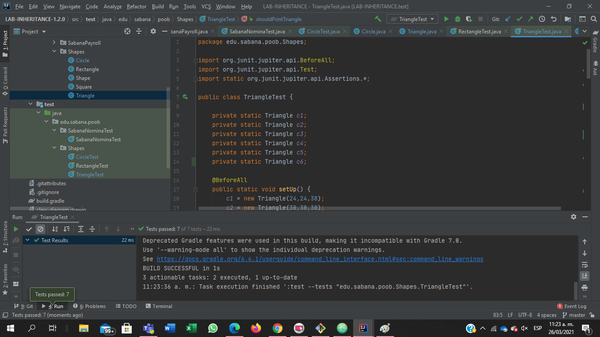
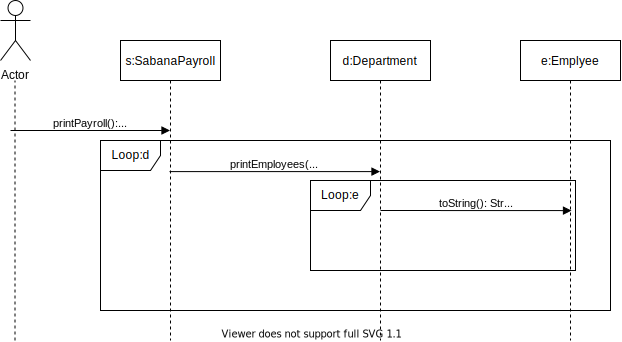
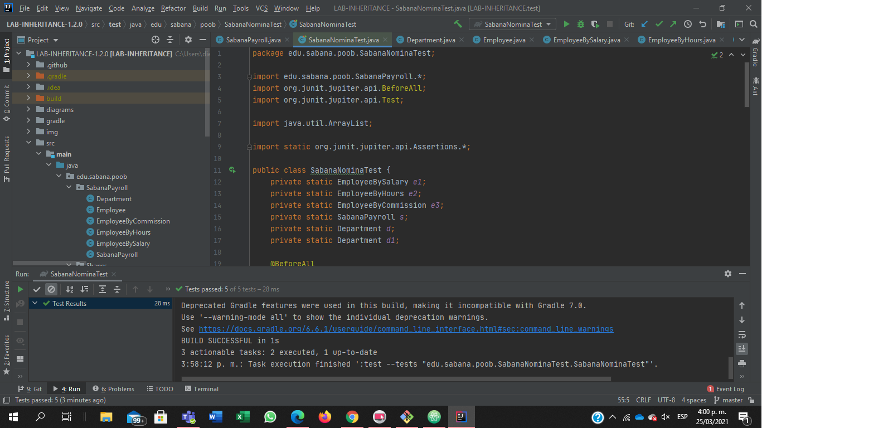

 # Parte 1
 ## Documentación
 ## Shape
 Esta clase representa una figura

 * toString(): Sobreescribe el metodo toString y plantea una platialla para imprimir las caracteristicas de una figura
            - return String caracteristicas de la la figura  clase-color
 ## Circle
 La clase Circle es una clase que hereda de la clase Shape, y representa el objeto de un circulo.
 Invariantes:
 * 1. PI = 3.14.....
 * 2. radius > 0

 * getArea():  Calcula el area de un ciruclo de un radio definido por radius
               - return double A = Area del circulo

 * getPerimeter(): Calcula el perimetro de un ciruclo de un radio definido por radius
                   return double P = perimetro del circulo

 * toString(): Sobreescribe el metodo toString de la clase Shape agregando el radio del circulo
               return Si el radio existe devuelve las caracteristicas del circulo, si el radio no existe regresa que el circulo del radio dado no existe

 * getDiameter(): Calcula el diametro de un ciruclo de un radio definido por radius
                   return double diametro del circulo
 ## Evidencia Pruebas

 

 # Parte 2

 ## Triangle
 ## Documentación
 La clase Triangle es una clase que hereda de la clase Shape, y representa el objeto de un triangle.

 * isIsoceles(): Verifica que un triangulo se isosceles - return True si el triangulo es isosceles False si no es isosceles

 * isEquilateral(): Verifica que un triangulo se equilatero - return True si el triangulo es equilatero False si no es equilatero

 * getArea(): Calcula el area de un triangulo de lados definidos - return double A = Area del circulo si el triangulo existe, si los lados del triangulo forman un triangulo que no existe devuelve 0.

 * getPerimeter(): Calcula el perimetro de un triangulo de lados definidos - return double P = Perimetro del circulo si el triangulo existe, si los lados del triangulo forman un triangulo que no existe devuelve 0.

 * toString(): Sobreescribe el metodo toString de la clase Shape agregando el tipo de triangulo - return Si el triangulo existe devuelve las caracteristicas , si el triangulo no existe regresa que el triangulo con la dimenciones dadas no existe

 ## Evidencia pruebas

 

 ## Rectangle & Square
 ## Documentación

 La clase Rectangle es una clase que hereda de la clase Shape y representa un rectangulo.
 La clase Square es una clase que hereda de Rectangle y representa un cuadrado.

 * getDiagonal(): Calcula la diagonal de un rectangulo o cuadrado, dado de su ancho y largo definidos - return double La diagonas de un rectangulo o cuadrado

 * getArea(): Calcula el area de un rectangulo o cuadrado, dado de su ancho y largo definidos - return double El area de un rectangulo o cuadrado

* getPerimeter(): Calcula el perimetro de un rectangulo o cuadrado, dado de su ancho y largo definidos - -return double El Perimetro de un rectangulo o cuadrado

* toString(): Sobreescribe el metodo toString de la clase Shape agregando la diagonal de un triangulo o cuadrado - return  Las caracteristicas del rectangulo o cuadrado.

 ## Evidencia pruebas

 

  ## Parte 3

 

  ## Parte 4

  ## UML

  

  ## Diagramas de secuencia

  ### calculateEmployeeSalary

  

  ### calculateDepartmentSalaries

  

  ### printPayroll

  

  ### calculateUniversitySalaries

  

  ## Documentación
  ### SabanaPayroll
  La clase SabanaPayroll representa la nomina de la universidad de la sabanapayroll

  * calculateDepartmentSalaries(UUID idDepartment): Este metod suma todos los salarios de todos los empleados de un deprtaento. - param idDepartment - return double Salarios de un departamento especifico

  * calculateEmployeeSalary(UUID idEmployee): Este metodo calcula el salario de un empleado en especifico. - param idEmployee - return double salario de un empleado

  * calculateUniversitySalaries(): Este metodo suma todos los salarios de todos los departamentos. - return double Salario de toda la universidad

  * printPayroll(): Imprime la lista de todos los empeados en la nomina de la universidad.

  * addDepartment(Department department): Añade un departamento a la lista de departamentos de la universidad. - param department

  ### Department
  La clase Department representa los departamentos de la Universidad

  * calculateDepartmentSalaries():  Este metodo calcula la suma de los salarios de los empleados. - return double el salario del departamento

  * findSalaryEmployee(UUID idEmployee): Este metodo busca a un empleado especifico. - param idEmployee - return double el salario de un empleado

  * printEmployees(): Este metodo guarda a los empleados de un departamento en un ArrayList. - return ArrayList</String>

  * addEmployee(Employee employee): Este metodo agrega a un empleado a un departamento. - param employee

  ### Employee
  La clase Employee representa a un empleado de la Universidad

  * toString(): Este metodo imprime al empleado y sus caracteristicas. - return String las caracteristicas del empleado.o

  ### EmployeeByCommission

  La clase EmployeeByCommission representa al un empleado que cobra por comisión.

  * calculateSalary(): Este metodo soreescribe el metodo calculateSalary y agrega el de empleado por comision. - return double Salario del empleado

  * toString(): Este metodo soreescribe el metodo calculateSalary y agrega el de empleado por comision. - return double Salario del empleado

  ### EmployeeByHours

  La clase EmployeeByHours representa al un empleado que cobra por hora.

  * calculateSalary(): Este metodo soreescribe el metodo calculateSalary y agrega el de empleado por hora. - return double Salario del empleado

  * toString(): Este metodo soreescribe el metodo calculateSalary y agrega el de empleado por hora. - return double Salario del empleado

  ### EmployeeSalary

  La clase EmployeeSalary representa al un empleado que tiene un salrio.

  * calculateSalary(): Este metodo soreescribe el metodo calculateSalary y agrega el de empleado por salario. - return double Salario del empleado

  * toString(): Este metodo soreescribe el metodo calculateSalary y agrega el de empleado por salario. - return double Salario del empleado

  ## Evidencia pruebas

  
